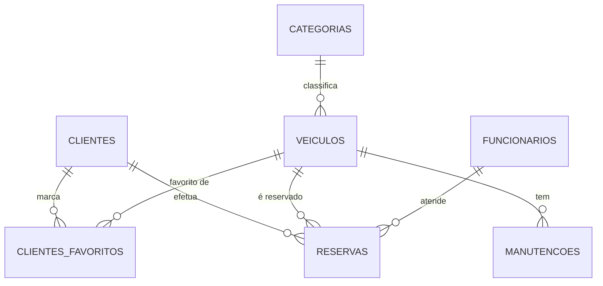

# Capítulo 2 – Arquitetura e Modelo de Dados

## 2.1 Arquitetura Geral do Sistema

A API **Car4Me** segue uma arquitetura **REST**, permitindo comunicação através de pedidos HTTP padronizados.  
O backend é implementado em **Node.js + Express**, enquanto os dados são persistidos num sistema **MySQL**.

A documentação técnica é fornecida em **OpenAPI 3.0** (ficheiro `api/openapi.yaml`), permitindo visualização e teste através do Swagger UI.

A imagem abaixo representa, de forma simplificada, a arquitetura geral do sistema:

> **[INSERIR AQUI]**  
> 

---

## 2.2 Estrutura de Pastas do Projeto

O projeto segue boas práticas de engenharia, com cada responsabilidade separada em diretórios específicos:

/
├── express-server/
│ ├── routes/ # Rotas por entidade
│ ├── controllers/ # Lógica de cada endpoint
│ ├── database/ # Ligação MySQL
│ ├── models/ # Modelos (opcional)
│ └── utils/ # Funções auxiliares
├── db/ # Scripts SQL
├── api/ # openapi.yaml
├── doc/ # Relatório
└── docker-compose.yml # Execução via Docker


> **[INSERIR AQUI]**  
> 

---

## 2.3 Tecnologias Utilizadas

| Tecnologia | Função |
|-----------|--------|
| **Node.js** | Ambiente de execução JavaScript |
| **Express** | Framework para API REST |
| **MySQL** | Base de dados relacional |
| **Docker** | Containerização e replicação de ambiente |
| **OpenAPI 3.0** | Documentação da API |
| **mysql2** | Driver para MySQL |
| **dotenv** | Gestão de variáveis de ambiente |

---

## 2.4 Ligação à Base de Dados (Excerto de Código)

A API estabelece ligação à BD através de um **pool**, permitindo múltiplas conexões simultâneas:

```js
import mysql from "mysql2/promise";

export const db = mysql.createPool({
    host: process.env.DB_HOST,
    user: process.env.DB_USER,
    password: process.env.DB_PASSWORD,
    database: process.env.DB_NAME,
});
```

## 2.5 Modelo de Dados Relacional

A base de dados do sistema Car4Me foi desenhada para refletir as operações reais de uma empresa de aluguer de veículos. O modelo segue uma estrutura relacional com múltiplas relações 1:N e uma relação N:N (favoritos).

### Entidades principais:

- **clientes**
- **veiculos**
- **categorias**
- **reservas**
- **funcionarios**
- **manutencoes**
- **clientes_favoritos** (relação N:N)

---

## 2.5.1 Diagrama ER


---
[< Previous](c1.md) | [^ Main](../../../) | [Next >](c3.md)
:--- | :---: | ---: 
