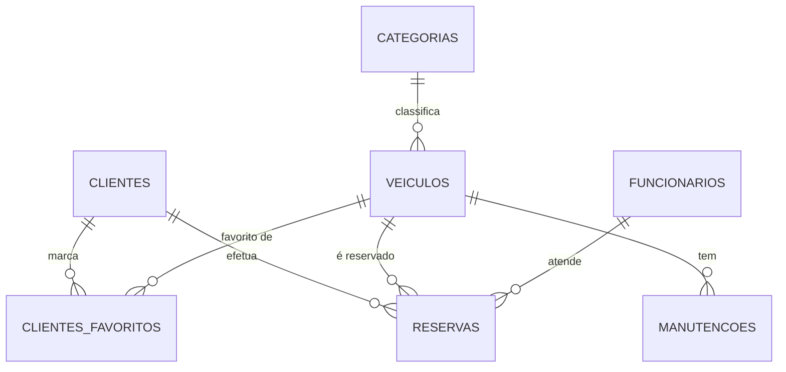

# Capítulo 2 – Arquitetura e Modelo de Dados

## 2.1 Arquitetura Geral do Sistema

A API **Car4Me** segue uma arquitetura **REST**, permitindo comunicação através de pedidos HTTP padronizados.  
O backend é implementado em **Node.js + Express**, enquanto os dados são armazenados numa base de dados **MySQL**.

A documentação técnica é fornecida em **OpenAPI 3.0** (ficheiro `api/openapi.yaml`), permitindo visualização e teste através do Swagger UI.

A imagem abaixo representa, de forma simplificada, a arquitetura geral do sistema:

> **[INSERIR AQUI]**  
> 

---

## 2.2 Estrutura de Pastas do Projeto

O projeto segue boas práticas de engenharia, com cada responsabilidade separada em diretórios específicos:

/
├── express-server/
│ ├── routes/ # Rotas por entidade
│ ├── controllers/ # Lógica de cada endpoint
│ ├── database/ # Ligação MySQL
│ ├── models/ # Modelos (opcional)
│ └── utils/ # Funções auxiliares
├── db/ # Scripts SQL
├── api/ # openapi.yaml
├── doc/ # Relatório
└── docker-compose.yml # Execução via Docker


> **[INSERIR AQUI]**  
> 

---

## 2.3 Tecnologias Utilizadas

| Tecnologia | Função |
|-----------|--------|
| **Node.js** | Ambiente de execução JavaScript |
| **Express** | Framework para API REST |
| **MySQL** | Base de dados relacional |
| **Docker** | Containerização e replicação de ambiente |
| **OpenAPI 3.0** | Documentação da API |
| **mysql2** | Driver para MySQL |
| **dotenv** | Gestão de variáveis de ambiente |

---

## 2.4 Ligação à Base de Dados (Excerto de Código)

A API estabelece ligação à BD através de um **pool**, permitindo múltiplas conexões simultâneas:

```js
import mysql from "mysql2/promise";

export const db = mysql.createPool({
    host: process.env.DB_HOST,
    user: process.env.DB_USER,
    password: process.env.DB_PASSWORD,
    database: process.env.DB_NAME,
});
```

## 2.5 Modelo de Dados Relacional

A base de dados do sistema Car4Me foi desenhada para refletir as operações reais de uma empresa de aluguer de veículos. O modelo segue uma estrutura relacional com múltiplas relações 1:N e uma relação N:N (favoritos).

### Entidades principais:

- **clientes**
- **veiculos**
- **categorias**
- **reservas**
- **funcionarios**
- **manutencoes**
- **clientes_favoritos** (relação N:N)

---

## 2.5.1 Diagrama ER



## 2.5.2 Descrição das Principais Tabelas

Abaixo descrevem-se as entidades principais da base de dados Car4Me, bem como os respetivos campos, funções e relações no sistema.

---

### **Tabela `categorias`**
Armazena os diferentes tipos de veículos disponíveis na empresa e o respetivo preço diário.

**Campos:**
- `id_categoria` – chave primária (INT, AI)
- `nome` – nome da categoria (único)
- `preco_dia` – preço por dia associado à categoria

---

### **Tabela `veiculos`**
Tabela central da frota de automóveis.

**Campos:**
- `id_veiculo` – chave primária (INT, AI)
- `marca` – ENUM de marcas pré-definidas
- `modelo` – modelo do veículo
- `matricula` – matrícula única
- `ano` – ano de fabrico
- `cor` – cor do veículo
- `quilometragem` – quilómetros atuais
- `estado` – ENUM (`Disponivel`, `Alugado`, `Manutencao`)
- `id_categoria` – chave estrangeira para `categorias`

**Relações:**
- Categoria (1) — (N) Veículos
- Veículo (1) — (N) Reservas
- Veículo (1) — (N) Manutenções
- Veículo (N) — (N) Clientes (via tabela `clientes_favoritos`)

---

### **Tabela `clientes`**
Armazena os dados pessoais dos clientes que realizam reservas.

**Campos:**
- `id_cliente` – chave primária (INT, AI)
- `nome`
- `email` – único
- `telefone`
- `nif` – único
- `morada`

**Relações:**
- Cliente (1) — (N) Reservas
- Cliente (N) — (N) Veículos Favoritos

---

### **Tabela `funcionarios`**
Armazena os funcionários responsáveis por gerir reservas e atender clientes.

**Campos:**
- `id_funcionario` – chave primária (INT, AI)
- `nome`
- `email` – único
- `cargo`
- `telefone`

**Relações:**
- Funcionário (1) — (N) Reservas

---

### **Tabela `reservas`**
Regista cada aluguer efetuado, ligando cliente, veículo e funcionário responsável.

**Campos:**
- `id_reserva` – chave primária (INT, AI)
- `id_cliente` – FK para `clientes`
- `id_veiculo` – FK para `veiculos`
- `id_funcionario` – FK para `funcionarios`
- `data_inicio`
- `data_fim`
- `preco_total`
- `estado` – ENUM (`ativa`, `concluida`, `cancelada`)

**Relações:**
- Reservas dependem de cliente + veículo + funcionário

---

### **Tabela `manutencoes`**
Armazena todas as intervenções de manutenção efetuadas num veículo.

**Campos:**
- `id_manutencao` – chave primária (INT, AI)
- `id_veiculo` – FK para `veiculos`
- `descricao`
- `data_manutencao`
- `custo`

**Relações:**
- Veículo (1) — (N) Manutenções

---

### **Tabela `clientes_favoritos` (Relação N:N)**

Tabela de junção que permite associar vários veículos como favoritos de um cliente e vice-versa.

**Campos:**
- `id_cliente` – FK para `clientes`
- `id_veiculo` – FK para `veiculos`
- **Chave primária composta:** (`id_cliente`, `id_veiculo`)

**Relação representada:**
- Cliente (N) — (N) Veículo  

## 2.6 Regras de Integridade (DELETE)

A base de dados implementa regras de negócio específicas que condicionam a eliminação de registos sensíveis, assegurando a integridade e consistência dos dados. Estas regras refletem o funcionamento real de uma empresa de aluguer de veículos, onde certos elementos não podem ser apagados enquanto existirem relações ativas.

### **2.6.1 Regras de Eliminação de Veículos**

Um veículo **não pode ser eliminado** se:

- possuir **reservas ativas**;
- possuir **reservas canceladas**;
- possuir **manutenções associadas** registadas na tabela `manutencoes`.

Um veículo **só pode ser eliminado** quando:

- não possuir qualquer reserva associada, **ou**
- todas as reservas associadas estiverem no estado **concluída**.

---

### **2.6.2 Regras de Eliminação de Clientes**

Um cliente **não pode ser eliminado** se:

- possuir qualquer reserva associada, independentemente do estado (ativa, concluída ou cancelada).

Um cliente **só pode ser apagado** quando:

- não possuir reservas registadas na tabela `reservas`.

---

### **2.6.3 Regras de Eliminação de Funcionários**

Um funcionário **não pode ser eliminado** quando:

- estiver associado a pelo menos uma reserva (ou seja, participou no atendimento).

Um funcionário **só pode ser apagado** quando:

- não tiver registos na tabela `reservas`.

Além disso:

> Existem funcionários especiais de atendimento, previamente definidos na base de dados, com os IDs:  
> **2, 4, 8, 13, 16, 20, 25, 30, 31, 39**, todos eles associados a operações reais de reservas.  
> Estes funcionários **nunca podem ser eliminados** pela API.

---

## 2.7 Docker e Execução

A API Car4Me pode ser executada de forma isolada e replicável através de Docker.  
O ficheiro `docker-compose.yml` define os serviços essenciais:

- **MySQL (sql)** – Base de dados persistente  
- **API (app)** – Servidor Node.js/Express  
- **Volumes** – Para persistência dos dados  
- **Rede interna** – Comunicação entre serviços

### Comando de execução

```bash
docker compose up -d
```

## 2.8 Documentação da API (OpenAPI 3.0)

A API Car4Me é documentada utilizando o padrão **OpenAPI 3.0**, através do ficheiro:


Este ficheiro descreve, de forma formal e estruturada:

- Os endpoints existentes na API;
- Os métodos suportados (GET, POST, PUT, DELETE);
- Os parâmetros aceites (route parameters, query parameters);
- Os filtros disponíveis (ex.: marca, estado, categoria);
- Os esquemas das entidades (clientes, veículos, reservas…);
- Os tipos de dados e validações;
- Os possíveis códigos de resposta HTTP;
- Os exemplos de requests e responses.

A documentação é automaticamente interpretada e apresentada em **Swagger UI**, que permite:

- testar cada endpoint diretamente no browser;  
- submeter dados em formulários automáticos;  
- visualizar resultados em JSON;  
- navegar pela API de forma intuitiva.

> **[INSERIR AQUI]**  
> 

---

### 2.8.1 Exemplo de Definição YAML – Listar Clientes

```yaml
paths:
  /clientes:
    get:
      summary: Listar clientes
      tags: [Clientes]
      responses:
        '200':
          description: Lista de clientes
          content:
            application/json:
              schema:
                type: array
                items:
                  $ref: '#/components/schemas/Cliente'
```
### 2.8.2 Exemplo de Filtros YAML – Listar Veículos com Query Parameters

```yaml
paths:
  /veiculos:
    get:
      summary: Listar veículos
      tags: [Veiculos]
      parameters:
        - in: query
          name: marca
          schema:
            type: string

        - in: query
          name: estado
          schema:
            type: string
            enum: [Disponivel, Alugado, Manutencao]

        - in: query
          name: id_categoria
          schema:
            type: integer

      responses:
        '200':
          description: Lista de veículos filtrada
```
### 2.8.3 Exemplo YAML – Schema da Relação Favoritos (N:N)

```yaml
components:
  schemas:
    Favorito:
      type: object
      properties:
        id_cliente:
          type: integer
        id_veiculo:
          type: integer
```
### 2.8.4 Estrutura do Ficheiro `openapi.yaml`

O ficheiro `openapi.yaml` contém toda a descrição formal da API Car4Me segundo o padrão **OpenAPI 3.0**.  
A sua estrutura segue uma organização hierárquica composta pelas seguintes secções principais:

- **`openapi:`**  
  Indica a versão da especificação utilizada (ex.: `3.0.3`).

- **`info:`**  
  Contém metadados sobre a API, tais como:
  - título do projeto  
  - descrição  
  - versão  
  - contacto (opcional)

- **`servers:`**  
  Define os servidores onde a API está disponível.  
  Exemplo:
  ```yaml
  servers:
    - url: http://localhost:8080
      description: Servidor local
  ```
  ### 2.8.4 Estrutura das Secções `paths` e `components` no OpenAPI

#### **`paths:`**
É a secção mais extensa do ficheiro OpenAPI.  
Aqui são definidos todos os endpoints da API e os métodos disponíveis para cada um.

Para cada *path* são documentados:

- **Operações suportadas** (GET, POST, PUT, DELETE)  
- **Parâmetros**  
  - route parameters  
  - query parameters (filtros)  
- **Filtros** (*query parameters*)  
- **Corpo de pedidos** (quando aplicável)  
- **Respostas e códigos HTTP** (200, 400, 404, 500…)  
- **Schemas utilizados** nas respostas e pedidos  

---

#### **`components:`**
É a secção onde se encontram elementos reutilizáveis dentro de toda a documentação.

Inclui:

- **`schemas:`**  
  Modelos de entidades, como *Cliente*, *Veículo*, *Reserva*, *Favorito*, etc.

- **`parameters:`**  
  Parâmetros comuns que podem ser reutilizados em vários endpoints.

- **`responses:`**  
  Respostas padronizadas que podem ser aplicadas a múltiplos paths.

- **`securitySchemes:`**  
  Definições de autenticação, caso existam (Bearer, API Key, OAuth…).

Esta organização torna a documentação clara, modular, escalável e compatível com qualquer ferramenta que suporte OpenAPI 3.0.

---

### 2.8.5 Importância da Documentação OpenAPI

A adoção da especificação **OpenAPI 3.0** traz diversos benefícios ao desenvolvimento e manutenção da API Car4Me:

#### **Padronização**
Garante uma descrição uniforme e clara de todos os endpoints, parâmetros, filtros e respostas.

#### **Integração facilitada**
Permite que qualquer equipa ou sistema externo compreenda a API sem necessidade de consultar código-fonte.

#### **Swagger UI automático**
A partir do ficheiro `openapi.yaml`, o Swagger gera automaticamente:

- interface gráfica interativa;  
- formulários automáticos para requests;  
- validação de parâmetros;  
- visualização de respostas JSON;  
- leitura clara de erros.

#### **Redução de erros**
Os developers sabem exatamente:
- que campos enviar,  
- que tipos de dados usar,  
- que respostas esperar.  

Isto reduz ambiguidades e problemas de integração.

#### **Documentação sempre atualizada**
Sempre que o ficheiro YAML é alterado, o Swagger UI reflete instantaneamente as mudanças.

#### **Base para ferramentas avançadas**
O ficheiro OpenAPI pode ser utilizado para:

- gerar automaticamente **SDKs**;  
- criar **clientes HTTP automáticos**;  
- gerar **mocks de API**;  
- criar **testes automatizados**;  
- validar contratos entre equipas (*contract-first development*).

---

### **Conclusão**
A documentação OpenAPI funciona como um **contrato formal** entre a API Car4Me e todos os seus consumidores, assegurando:

- consistência;  
- clareza;  
- interoperabilidade;  
- facilidade de manutenção;  
- e robustez na evolução do sistema.


---
[< Previous](c1.md) | [^ Main](../../../) | [Next >](c3.md)
:--- | :---: | ---: 
